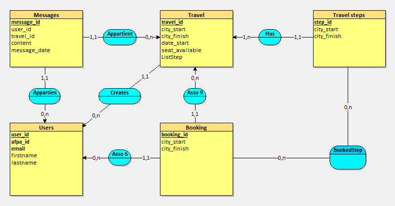

# Blablafpa

### Contexte : 
Créer un site web de covoiturage type 'BlaBlaCar' pour le personnel et les stagiaires de l'AFPA.
Le projet a été fait en groupe (@ChristopherSemard, @Aminebouaich, @damirdine)

### Le site web devra regrouper les fonctionnalités suivantes : 
    - Authentification utilisateur
    - Une personne va pouvoir créer des trajets, rechercher des trajets et se positionner sur un trajet.
    - Gestion du nombre de places disponibles
    - Gestion des étapes dans la création du trajet
    - Gestion des parties de trajet dans la recherche
    - Discussion possible entre le conducteur et les passagers

## Objectif : 
- #### Travailler en collaboration avec Git :
    - création de branche par personne 
    - pull request sur la branche principale
    - merge des fonctionnalités
- #### Organiser projet pour travailler en équipe : 
    - Modèle MVC (Model view controller)
    - Répartition des tâches pour tenir un délai
- ### Conception base de données  : 
 schéma de base de donnée qui regroupe les entités nécessaires pour produire les fonctionnalités demandées

